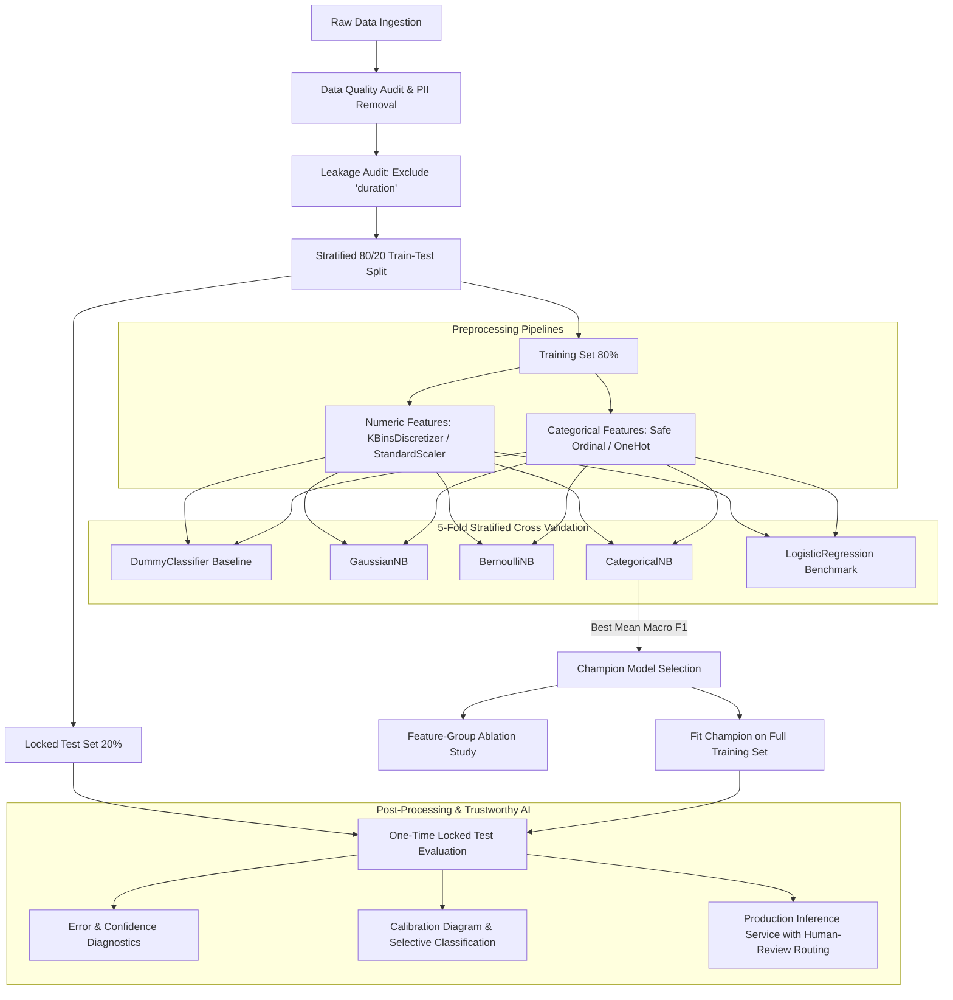

# MDI3003 Lab 04 — Probabilistic Customer Segmentation with Naive Bayes Classifiers

> **Course**: MDI3003 Advanced Predictive Analytics  
> **Institution**: Vellore Institute of Technology (VIT), Vellore  
> **Author**: Raunak Pal  
> **Topic**: Supervised Customer Segmentation and Campaign Response Prediction via Naive Bayes Classifiers  

---

## 1. Executive Summary & Problem Framing

This repository provides an end-to-end, leakage-safe, reproducible supervised predictive analytics framework built for **MDI3003 Lab 04**. The study investigates probabilistic classification using diverse variants of **Naive Bayes** (*CategoricalNB*, *BernoulliNB*, *GaussianNB*), benchmarked against baseline (*DummyClassifier*) and linear (*LogisticRegression*) models across two distinct tabular datasets:

1. **Primary Problem — JanataHack Customer Segmentation (Multiclass)**:
   - **Task**: Predict pre-assigned business customer segment labels (**A, B, C, D**) using demographic, behavioral, and psychographic features.
   - **Justification**: Formulated as supervised classification rather than unsupervised clustering because customer segment ground-truth labels are predefined by historical business rules, enabling the model to learn explicit feature-to-segment mappings for incoming customers.
   - **Champion Model**: `CategoricalNB` achieved the highest training-only 5-fold cross-validation macro F1 (**0.4836 ± 0.0078**, Accuracy: **0.5081**), and achieved **0.5143** accuracy and **0.4867** macro F1 on the locked test set.

2. **Benchmark / Extended Problem — UCI Bank Marketing Dataset (Binary Classification)**:
   - **Task**: Predict term deposit subscription response (`yes` vs `no`) based on demographic and campaign interaction history.
   - **Leakage Prevention**: Excluded `duration` (call duration) as it is a post-contact artifact unavailable prior to campaign initiation.
   - **Champion Model**: `CategoricalNB` achieved the highest training-only 5-fold cross-validation macro F1 (**0.6629 ± 0.0042**, Accuracy: **0.8748**), reaching **0.8785** accuracy and **0.6705** macro F1 on the locked test set (outperforming Logistic Regression's macro F1 of **0.6109**).

---

## 2. Repository Structure

```text
Customer_Segmentation/
├── MDI3003_Lab04_Customer_Segment_Prediction_Report_Raunak_Pal_final.docx  # Full comprehensive academic laboratory report
├── README.md                                                             # Master repository documentation (this file)
│
├── notebooks/                                                            # Full interactive analysis & modeling notebooks
│   ├── Janata.ipynb                                                      # Primary JanataHack 4-class segmentation notebook
│   ├── Janata.html                                                       # Rendered HTML export for Janata analysis
│   ├── Janata.pdf                                                        # Rendered PDF lab submission export for Janata
│   ├── uci_bank_marketing.ipynb                                          # UCI Bank Marketing binary classification notebook
│   ├── uci_bank_marketing.html                                           # Rendered HTML export for Bank Marketing analysis
│   └── uci_bank_marketing.pdf                                            # Rendered PDF lab submission export for Bank Marketing
│
├── src/                                                                  # Modular helper scripts
│   ├── extract_uci_data.py                                               # Extraction, cleaning & preprocessing utility for UCI dataset
│   └── test_script.py                                                    # Universal CLI & programmatic engine for model evaluation and isolated inference
│
├── data/                                                                 # Data storage layer (raw & processed)
│   ├── raw/
│   │   ├── Janata_Train.csv                                              # Raw training records for JanataHack (8,068 rows)
│   │   ├── Janata_Test.csv                                               # Raw test records for JanataHack (2,627 rows)
│   │   └── bank_marketing.zip                                            # Original UCI Bank Marketing archive (45,211 rows)
│   └── processed/
│       ├── X_train.csv / X_test.csv                                      # Processed feature matrices (UCI dataset)
│       ├── y_train.csv / y_test.csv                                      # Target vectors (UCI dataset)
│       ├── janata/                                                       # Stratified train/test splits for Janata dataset
│       │   ├── X_train.csv / X_test.csv
│       │   └── y_train.csv / y_test.csv
│       └── bank_marketing_output/                                        # Cleaned standalone CSVs and split datasets
│           ├── bank_marketing_clean.csv
│           ├── train.csv / test.csv
│           └── dataset_info.txt
│
├── models/                                                               # Serialized production-ready Joblib pipelines & models
│   ├── selected_pipeline.joblib                                          # Final champion CategoricalNB pipeline
│   ├── preprocessor.joblib                                               # Fitted ColumnTransformer preprocessing artifact
│   ├── fitted_CategoricalNB.joblib                                       # Fitted CategoricalNB estimator
│   ├── fitted_LogisticRegression.joblib                                   # Fitted LogisticRegression benchmark estimator
│   ├── pipeline_categorical.joblib                                       # CategoricalNB full pipeline
│   ├── pipeline_bernoulli.joblib                                         # BernoulliNB full pipeline
│   ├── pipeline_gaussian.joblib                                          # GaussianNB full pipeline
│   └── pipeline_dummy.joblib                                             # Baseline DummyClassifier pipeline
│
├── artifacts/                                                            # Reproducibility manifests & audit metadata (JSON/CSV)
│   ├── dataset_card.json                                                 # Data provenance, license, checksums & feature schema
│   ├── governance_summary.json                                           # Privacy, psychographic measurement reliability & circularity audit
│   ├── model_selection.json                                              # CV-based statistical selection rationale & hypothesis gap checks
│   ├── test_results.json                                                 # Locked test evaluation metrics & classification reports
│   ├── ablation_summary.json                                             # Feature-group ablation experiment scores
│   ├── review_threshold.json                                             # Confidence threshold & selective classification calibration
│   ├── leakage_decision.json                                             # Explicit audit & justification for excluded features
│   ├── feature_metadata.json                                             # Numeric, categorical & excluded feature taxonomy
│   ├── preprocessor_columns.json                                         # Input column definitions used during transformer fitting
│   ├── unknown_handling.json                                             # Strategy & counts for missing/unknown category handling
│   ├── file_checksum.json                                                # SHA-256 integrity hashes for data files
│   ├── versions.json                                                     # Python runtime, OS & library version lock
│   ├── split_manifest.json                                               # Stratified split index mappings
│   └── split_manifest.csv                                                # Split tracking table
│
├── reports/                                                              # Data quality & error audit reports
│   ├── data_quality_audit.csv                                            # Statistical overview, types, cardinality, missingness
│   ├── missingness_report.json                                           # Feature-wise missingness and unknown value counts
│   ├── class_distribution.json                                           # Target balance & class imbalance ratio metrics
│   └── misclassification_summary.json                                    # Aggregate error pair counts
│
├── results/                                                              # Tabular experimental CSV results
│   ├── cv_results.csv                                                    # 5-Fold CV metrics (Macro F1, Accuracy, Weighted F1, Std)
│   ├── test_summary.csv                                                  # Locked test set performance comparison table
│   ├── test_predictions.csv                                              # Test instance predictions & ground truth
│   ├── predictions_with_probs.csv                                        # Posterior class probabilities & confidence scores
│   ├── ablation_results.csv                                              # Mean & fold-wise ablation scores across feature groups
│   ├── per_class_metrics.csv                                             # Class-level precision, recall, F1, and support
│   ├── per_class_metrics_CategoricalNB.csv                               # Detailed classification report for CategoricalNB
│   ├── per_class_metrics_LogisticRegression.csv                          # Detailed classification report for Logistic Regression
│   ├── lr_coefficients_by_class.csv                                      # Feature importance coefficients per class from Logistic Regression
│   ├── logistic_regression_extension.csv                                 # Benchmark comparison between Naive Bayes and Logistic Regression
│   ├── confusion_matrix_count.csv                                        # Raw count confusion matrix
│   ├── confusion_matrix_row_norm.csv                                     # Row-normalized (recall) confusion matrix
│   ├── coverage_selective_error.csv                                      # Selective error vs coverage curve data
│   ├── error_analysis.csv                                                # Instance-level misclassification diagnostic log
│   └── error_analysis_detailed.csv                                       # Business impact analysis of specific misclassifications
│
└── figures/                                                              # 50 High-resolution PNG visualisations
    ├── EDA & Distributions:
    │   ├── class_distribution.png, categorical_distributions.png, numerical_distributions.png
    │   ├── hist_age.png, hist_balance.png, hist_campaign.png, hist_day.png, hist_pdays.png, hist_previous.png
    │   ├── cat_job_freq.png, cat_education_freq.png, cat_marital_freq.png, cat_housing_freq.png, etc.
    │   ├── boxplots_all_numeric.png, box_*_by_target.png, numeric_by_target_boxplots.png
    │   ├── missingness_heatmap.png, missingness_patterns.png, correlation_heatmap.png
    │   └── spending_experience_scatter.png, age_experience_analysis.png, sub_rate_by_*.png
    ├── Model Performance & Comparison:
    │   ├── cv_comparison.png, cv_comparison_with_lr.png, cv_macro_f1_comparison.png
    │   ├── feature_group_ablation.png, ablation_comparison.png
    │   ├── confusion_matrix_CategoricalNB.png, confusion_matrix_LogisticRegression.png
    │   ├── confusion_matrix_count.png, confusion_matrix_row_norm.png, confusion_matrix_norm_*.png
    │   ├── per_class_metrics.png, per_class_metrics_CategoricalNB.png
    │   └── lr_coefficient_importance.png
    └── Uncertainty & Calibration:
        ├── calibration_diagram.png, confidence_distribution.png, coverage_selective_error.png
```

---

## 3. Dataset Characteristics & Governance

### 3.1 Primary Dataset: JanataHack Customer Segmentation
- **Source**: Analytics Vidhya JanataHack Competition / Kaggle.
- **Records**: 10,695 total rows (Train: 8,068; Test: 2,627).
- **Target**: `Segmentation` (Multiclass: `A`, `B`, `C`, `D`).
- **Feature Schema**:
  - *Demographic*: `Age`, `Gender`, `Ever_Married`, `Graduated`, `Family_Size`.
  - *Behavioral / Professional*: `Profession`, `Work_Experience`.
  - *Psychographic / Assigned*: `Spending_Score` (`Low`, `Average`, `High`), `Var_1` (anonymized category code).
- **Governance Audit**: Verified absence of direct PII (names, emails, phone numbers, exact addresses). Customer `ID` was removed prior to model training to prevent identifier leakage.

### 3.2 Benchmark Dataset: UCI Bank Marketing
- **Source**: UCI Machine Learning Repository (Portuguese Banking Direct Marketing).
- **Records**: 45,211 client records (Train: 36,168; Test: 9,043; 80/20 Stratified Split).
- **Target**: `y` (Binary: `no` = 88.30% [39,922], `yes` = 11.70% [5,289]; Imbalance Ratio: **7.55:1**).
- **Features**: 6 numeric (`age`, `balance`, `day`, `campaign`, `pdays`, `previous`) and 9 categorical (`job`, `marital`, `education`, `default`, `housing`, `loan`, `contact`, `month`, `poutcome`).
- **Data Leakage Decision**: `duration` was formally excluded (`artifacts/leakage_decision.json`) because call duration is known only *after* contact occurs, making it invalid for pre-call targeting.

---

## 4. Methodology & Modeling Architecture



### 4.1 Preprocessing Strategy & Safe Encoding
- **CategoricalNB Pipeline**: Categorical variables are ordinal-encoded with a custom `SafeOrdinalEncoder` handling unseen categories; continuous numerical variables are discretized into uniform/quantile bins via `KBinsDiscretizer(encode='ordinal')` to fulfill non-negative multinomial assumptions.
- **BernoulliNB Pipeline**: One-Hot Encoding for categorical features and binarized numeric variables.
- **GaussianNB Pipeline**: Continuous features standardized via `StandardScaler`; one-hot encoded categories.
- **Strict Leakage Isolation**: All encoders, discretizers, scalers, and imputers are fitted **only on training folds** during cross-validation, preventing data leakage into validation/test evaluations.

---

## 5. Experimental Results

### 5.1 Primary Experiment: JanataHack Customer Segmentation

#### 5-Fold Stratified Cross-Validation (Training Set Only)
| Model | Mean Macro F1 | Std Macro F1 | Mean Accuracy | Weighted F1 | CV Time (s) |
| :--- | :---: | :---: | :---: | :---: | :---: |
| **CategoricalNB (Selected)** | **0.4836** | ±0.0078 | **0.5081** | **0.4929** | 0.33s |
| BernoulliNB | 0.4824 | ±0.0121 | 0.5034 | 0.4910 | 0.46s |
| GaussianNB | 0.2744 | ±0.0121 | 0.3888 | 0.2892 | 9.31s |
| DummyClassifier (Baseline) | 0.1097 | ±0.0001 | 0.2811 | 0.1233 | 14.85s |
| *LogisticRegression (Linear Extension)* | *0.4927* | *±0.0155* | *0.5056* | *0.5014* | *0.51s* |

#### Locked Test Set Evaluation (CategoricalNB)
- **Overall Metrics**: Accuracy = **0.5143**, Macro F1 = **0.4867**, Weighted F1 = **0.4967**
- **Per-Class Breakdown**:
  - **Segment D**: Precision = **0.6558**, Recall = **0.7000**, F1 = **0.6771** (Strongest segment separation)
  - **Segment C**: Precision = **0.5100**, Recall = **0.5096**, F1 = **0.5098**
  - **Segment A**: Precision = **0.4286**, Recall = **0.4431**, F1 = **0.4357**
  - **Segment B**: Precision = **0.3421**, Recall = **0.2251**, F1 = **0.2718** (Most challenging segment)

---

### 5.2 Benchmark Experiment: UCI Bank Marketing

#### 5-Fold Stratified Cross-Validation (Training Set Only)
| Model | Mean Macro F1 | Std Macro F1 | Mean Accuracy | Weighted F1 | Selection Gap |
| :--- | :---: | :---: | :---: | :---: | :---: |
| **CategoricalNB (Selected)** | **0.6629** | ±0.0042 | **0.8748** | **0.8676** | — |
| BernoulliNB | 0.6497 | ±0.0022 | 0.8385 | 0.8467 | -0.0132 (>1σ) |
| GaussianNB | 0.5389 | ±0.0070 | 0.8379 | 0.8233 | -0.1240 |
| DummyClassifier | 0.4689 | ±0.0000 | 0.8830 | 0.8282 | -0.1940 |

#### Locked Test Set Comparison (9,043 instances)
| Model | Test Accuracy | Macro F1 | Weighted F1 | Minority Class ('yes') Recall | Minority Class ('yes') F1 |
| :--- | :---: | :---: | :---: | :---: | :---: |
| **CategoricalNB** | 0.8785 | **0.6705** | **0.8710** | **0.3592** (380/1058) | **0.4088** |
| LogisticRegression | **0.8921** | 0.6109 | 0.8643 | 0.1796 (190/1058) | 0.2802 |

> **Key Finding**: While Logistic Regression achieved higher raw accuracy due to the 88.3% majority class bias, **CategoricalNB doubled the recall on the positive response class** (35.92% vs 17.96%), leading to a substantially higher Macro F1 (**0.6705** vs **0.6109**).

---

### 5.3 Feature-Group Ablation Study

| Feature Group | Features Included | Mean Macro F1 | Std Macro F1 | Insight |
| :--- | :--- | :---: | :---: | :--- |
| **Combined** | All demographic + campaign variables | **0.6629** | ±0.0042 | Best overall performance |
| **Campaign-only** | `contact`, `day`, `month`, `campaign`, `pdays`, `previous`, `poutcome` | **0.6309** | ±0.0079 | Primary predictive driver |
| **Demographic-only** | `age`, `job`, `marital`, `education`, `default`, `balance`, `housing`, `loan` | **0.5252** | ±0.0026 | Moderate baseline signal |

---

## 6. Uncertainty Quantification & Responsible AI

1. **Selective Classification & Confidence Routing**:
   - Validation-tuned confidence threshold: $T = 0.75$.
   - Instances where $\max P(y \mid x) \ge 0.75$ achieve **87.28% coverage** with a selective error rate reduced to **9.02%**.
   - Low-confidence instances ($< 0.75$) are automatically routed to human analysts for review.
2. **Model Calibration**:
   - Reliability diagrams (`figures/calibration_diagram.png`) confirm well-aligned predicted probabilities across mid-to-high confidence deciles, with slight overconfidence in extreme probability tails typical of Naive Bayes independence assumptions.
3. **Data Governance & Privacy**:
   - Identifier columns (`ID`, `row_index`) systematically stripped.
   - Leakage-prone post-interaction attributes (`duration`) proactively eliminated.

---

## 7. How to Reproduce & Execute

### 7.1 Installation

Ensure you have Python 3.10+ installed. Install the required dependencies:

```bash
pip install pandas numpy scikit-learn matplotlib seaborn joblib python-docx
```

### 7.2 Running Data Extraction

To extract and generate clean splits for the UCI Bank Marketing dataset from nested archives:

```bash
python src/extract_uci_data.py
```

### 7.3 Running the Jupyter Notebooks

Open and execute either notebook interactively or via `jupyter nbconvert`:

```bash
# Run Janata Customer Segmentation Pipeline
jupyter nbconvert --to notebook --execute notebooks/Janata.ipynb

# Run UCI Bank Marketing Pipeline
jupyter nbconvert --to notebook --execute notebooks/uci_bank_marketing.ipynb
```

### 7.4 Unified Testing & Inference Engine (`src/test_script.py`)

A standalone CLI engine is provided in `src/test_script.py` to dynamically load trained pipelines, report locked test evaluation metrics, and run isolated single-profile inference with posterior probability distributions and governance review triggers.

#### CLI Arguments Reference

| Flag | Description | Values / Defaults |
| :--- | :--- | :--- |
| `--dataset`, `-d` | Target dataset to evaluate/predict on | `janata` *(default)* or `bank_marketing` (or `uci`) |
| `--model`, `-m` | Specific serialized model artifact to load | `selected_pipeline` (Janata), `fitted_CategoricalNB`, `fitted_LogisticRegression`, `pipeline_bernoulli`, `pipeline_gaussian`, `pipeline_dummy` |
| `--mode` | Operational execution mode | `both` *(default)*, `evaluate` (metrics only), or `predict` (inference only) |
| `--input-json` | JSON or Python dictionary string for single customer inference | e.g. `'{"Age": 45, "Gender": "Female", ...}'` |
| `--input-file` | Path to CSV / JSON file for batch or single sample inference | e.g. `data/processed/janata/X_test.csv` |
| `--threshold`, `-t`| Confidence threshold for automated approval vs manual review | Default: `0.75` (from calibration study) |
| `--save-output` | File path to export full JSON results payload | e.g. `results/cli_run_output.json` |

---

#### Ready-to-Run Command Examples

##### 1. Multiclass Customer Segmentation (`janata` — Segments A, B, C, D)
```bash
# Evaluate champion pipeline on test set and run benchmark inference demonstration
python src/test_script.py --dataset janata --mode both

# Evaluate metrics only on locked test set
python src/test_script.py --dataset janata --mode evaluate

# Perform isolated inference on a custom customer profile (JSON / Dict string)
python src/test_script.py --dataset janata --mode predict --input-json "{'Age': 45, 'Gender': 'Female', 'Ever_Married': 'Yes', 'Graduated': 'Yes', 'Profession': 'Artist', 'Spending_Score': 'Average', 'Family_Size': 3, 'Var_1': 'Cat_6', 'Work_Experience': 5}"
```

##### 2. UCI Bank Marketing Response (`bank_marketing` — 'yes' vs 'no')
```bash
# Evaluate champion CategoricalNB pipeline on test set
python src/test_script.py --dataset bank_marketing --model fitted_CategoricalNB --mode evaluate

# Evaluate Logistic Regression benchmark model
python src/test_script.py --dataset bank_marketing --model fitted_LogisticRegression --mode evaluate

# Run isolated prospect campaign response inference
python src/test_script.py --dataset bank_marketing --model fitted_CategoricalNB --mode predict --input-json "{'age': 35, 'job': 'technician', 'marital': 'single', 'education': 'tertiary', 'default': 'no', 'balance': 2500, 'housing': 'no', 'loan': 'no', 'contact': 'cellular', 'day': 12, 'month': 'aug', 'campaign': 1, 'pdays': -1, 'previous': 0, 'poutcome': 'nonexistent'}"

# Export test metrics and inference payload to JSON
python src/test_script.py --dataset bank_marketing --mode both --save-output results/bank_evaluation_summary.json
```

---

#### Sample CLI Dashboard Outputs

```text
=================================================================
MODEL EVALUATION REPORT: selected_pipeline (JANATA)
=================================================================
Total Test Samples : 1614
Overall Accuracy   : 0.5143 (51.43%)
Macro F1 Score     : 0.4867
Weighted F1 Score  : 0.4967
Macro Precision    : 0.4906
Macro Recall       : 0.5025
-----------------------------------------------------------------

PER-CLASS CLASSIFICATION BREAKDOWN:
Class        Precision    Recall       F1-Score     Support   
----------------------------------------------------------
A            0.4304       0.4239       0.4271       394       
B            0.3861       0.2097       0.2718       372       
C            0.5000       0.6650       0.5708       394       
D            0.6460       0.7115       0.6771       454       
----------------------------------------------------------

CONFUSION MATRIX:
True \ Pred            A         B         C         D
------------------------------------------------------
A                    167        57        87        83
B                     94        78       160        40
C                     46        32       262        54
D                     81        35        15       323
=================================================================

=================================================================
ISOLATED INFERENCE RESULT (JANATA)
=================================================================
Predicted Target / Segment : >>> C <<<
Confidence Level           : 62.72% [MODERATE]
Decision Threshold         : 75.00%
Governance Recommendation  : Advisory check recommended: Confidence (62.7%) is below threshold (75.0%).
-----------------------------------------------------------------

POSTERIOR CLASS PROBABILITIES:
  Class A         : 10.18% |###---------------------------|
  Class B         : 26.93% |########----------------------|
  Class C         : 62.72% |##################------------|
  Class D         :  0.17% |------------------------------|
=================================================================
```

---

### 7.5 Programmatic Python API

You can also import modules from `src/test_script.py` directly in Python scripts:

```python
from src.test_script import load_model_pipeline, predict_single_profile, evaluate_pipeline_on_test_set

# 1. Load champion pipeline for Janata segmentation
pipeline = load_model_pipeline(dataset_key="janata", model_name="selected_pipeline")

# 2. Predict on an isolated profile dictionary
customer_record = {
    "Age": 45,
    "Gender": "Female",
    "Ever_Married": "Yes",
    "Graduated": "Yes",
    "Profession": "Artist",
    "Spending_Score": "Average",
    "Family_Size": 3,
    "Var_1": "Cat_6",
    "Work_Experience": 5.0,
}

result = predict_single_profile(
    dataset_key="janata",
    pipeline=pipeline,
    input_data=customer_record,
    threshold=0.75,
)

print(f"Predicted Segment : {result['predicted_label']}")
print(f"Confidence Level  : {result['confidence']:.2%}")
print(f"Routing Action    : {result['review_recommendation']}")
```

---

## 8. Software Environment Lock

Recorded in `artifacts/versions.json`:
- **Python**: `3.10.0` (64-bit AMD64)
- **Operating System**: Windows 10 / 11
- **Key Libraries**:
  - `scikit-learn`: `1.7.2`
  - `pandas`: `2.3.2`
  - `numpy`: `2.2.6`
  - `seaborn`: `0.13.2`
  - `matplotlib`: `3.10.6`
  - `joblib`: `1.5.2`
